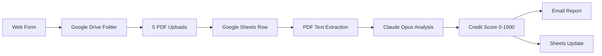
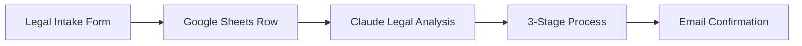
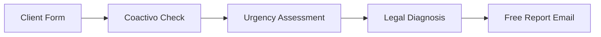

# Ekinoxis n8n — Multi-Agent Automation Platform

A sophisticated multi-agent automation platform built on n8n for Ekinoxis financial and legal services in Colombia. This system combines automated workflows with AI-powered analysis to provide enterprise credit evaluation, credit score recovery, and traffic fines legal services.

## 🚀 Quick Start

**New here?** Start with [`QUICKSTART.md`](QUICKSTART.md) for the complete zero-to-running guide.

**For developers:** Boot your Claude agent from [`CLAUDE.md`](CLAUDE.md) to access the agent system.

## 📋 System Overview

### What This Platform Does

| Service | Workflow | AI Model | Function |
|---------|----------|----------|----------|
| **Enterprise Credit Evaluation** | WF01 | Claude Opus 4.6 | Form → Document analysis → Credit score → Email report |
| **Credit Score Recovery** | WF02 | Claude Sonnet 4.6 | Legal intake → Case analysis → Multi-stage process |
| **Traffic Fines Legal Aid** | WF03 | Claude Sonnet 4.6 | Client intake → Urgency assessment → Legal guidance |

### Tech Stack

- **n8n** — Workflow automation engine (runs locally or self-hosted)
- **Claude API** — AI analysis via Anthropic (opus-4-6, sonnet-4-6)
- **Google Drive** — Document storage with auto-folder creation
- **Google Sheets** — Client data tracking across 3 specialized tabs
- **Resend SMTP** — Transactional email delivery
- **Claude Code Agents** — 4 specialized AI agents for system maintenance

## 🏗️ Architecture

### Multi-Agent System

| Agent | Model | Responsibility | Directory |
|-------|-------|---------------|-----------|
| **ARIA** | Claude Opus 4.6 | Financial analysis & WF01 | [`agents/agent-1-aria/`](agents/agent-1-aria/) |
| **LEXI** | Claude Sonnet 4.6 | Legal services & WF02+03 | [`agents/agent-2-lexi/`](agents/agent-2-lexi/) |
| **NOVA** | Claude Haiku 4.5 | Operations & notifications | [`agents/agent-3-nova/`](agents/agent-3-nova/) |
| **ECHO** | Claude Sonnet 4.6 | n8n infrastructure & tech | [`agents/agent-4-echo/`](agents/agent-4-echo/) |

### Project Structure

```
/ekinoxis-n8n/
├── README.md                        ← You are here
├── QUICKSTART.md                    ← Zero-to-running setup guide
├── CLAUDE.md                        ← Agent coordination & boot instructions
├── scripts/
│   └── launch-agents.sh             ← Launch all 4 agents in tmux 2×2 grid
├── agents/
│   ├── COORDINATION.md              ← Shared task board (all agents)
│   ├── agent-1-aria/                ← ARIA: Financial analyst
│   ├── agent-2-lexi/                ← LEXI: Legal advisor
│   ├── agent-3-nova/                ← NOVA: Operations manager
│   └── agent-4-echo/                ← ECHO: Technical lead
└── workflows/
    ├── 01-enterprise-credit-evaluation.json
    ├── 02-credit-score-recovery.json
    ├── 03-traffic-fines.json
    ├── .env.example
    └── README.md
```

## ⚡ Getting Started

### Prerequisites

- Node.js ≥ 18
- [Anthropic API key](https://console.anthropic.com/)
- [Google Cloud Console](https://console.cloud.google.com/) access
- [Resend](https://resend.com/) account for SMTP

### 1. Launch n8n

```bash
# Option A: Docker (recommended)
docker run -it --rm --name n8n -p 5678:5678 -v ~/.n8n:/home/node/.n8n n8nio/n8n

# Option B: npx
npx n8n
```

Open: http://localhost:5678

### 2. Quick Setup

1. **Set environment variables** in n8n Settings
2. **Create 4 credentials**: Anthropic, Google Drive OAuth2, Google Sheets OAuth2, SMTP
3. **Set up Google Sheets** with 3 tabs: `Credit_Evaluations`, `Credit_Recovery_Clients`, `Traffic_Fines_Cases`
4. **Import workflows** from the `workflows/` directory
5. **Activate workflows** and copy form URLs

**Full detailed instructions:** [`QUICKSTART.md`](QUICKSTART.md)

## 🤖 Claude Agent System

### For Developers

The 4 Claude Code agents maintain and evolve this system:

```bash
# Launch all agents at once (requires tmux)
chmod +x scripts/launch-agents.sh
./scripts/launch-agents.sh
```

This creates a 2×2 tmux session:

```
┌─────────────────────┬─────────────────────┐
│  ARIA  (opus-4-6)   │  LEXI (sonnet-4-6)  │
│  WF01 Financial     │  WF02+03 Legal      │
├─────────────────────┼─────────────────────┤
│  NOVA  (haiku-4-5)  │  ECHO (sonnet-4-6)  │
│  Operations + Data  │  n8n Infrastructure │
└─────────────────────┴─────────────────────┘
```

### Single Agent Boot

1. Open Claude Code in this project
2. Tell Claude: "Boot as ARIA" (or LEXI/NOVA/ECHO)
3. Claude reads the agent's identity and current tasks
4. Work begins on highest-priority items

## 📊 Data Flow

### WF01: Enterprise Credit Evaluation



**Input:** Company data + 5 PDFs (Certificate, Balance, Income Statement, Cash Flow, RUT)  
**Output:** Credit score, risk assessment, email report with recommendations

### WF02: Credit Score Recovery



**Input:** Client personal/legal data  
**Output:** Case ID, legal strategy, multi-stage recovery process

### WF03: Traffic Fines Legal Aid



**Input:** Personal data + vehicle/fine details  
**Output:** Legal diagnosis, urgency level, free consultation

## 🔧 Technical Details

### Environment Variables

Set these in n8n Settings → Environment Variables:

```bash
GOOGLE_SHEET_ID=your_spreadsheet_id
GOOGLE_DRIVE_PARENT_FOLDER_ID=your_drive_folder_id  # Optional
FROM_EMAIL=your_verified_sending_domain
```

### Required Credentials in n8n

| Credential Name | Type | Usage |
|----------------|------|--------|
| `Anthropic` | Anthropic API | Claude models in workflows |
| `Google Drive` | Google Drive OAuth2 | Document storage |
| `Google Sheets` | Google Sheets OAuth2 | Client data tracking |
| `Email SMTP` | SMTP (Resend) | Transactional emails |

### Google Sheets Schema

Each workflow writes to a dedicated sheet tab with specific columns for tracking client data, case progression, and analysis results. See [`QUICKSTART.md`](QUICKSTART.md) for complete schema details.

## 🌐 Colombia-Specific Features

- **COP currency formatting** for financial calculations
- **NIT/RUT validation** for Colombian business identification
- **Colombian legal framework** integration for traffic/credit law
- **DataCrédito context** for credit analysis
- **Spanish language** for all client-facing content
- **Colombian time zone** (America/Bogota) for timestamps

## 🛠️ Development

### Agent Responsibilities

- **ARIA:** Financial analysis algorithms, WF01 improvements
- **LEXI:** Legal content, WF02/WF03 case logic, Colombian law updates
- **NOVA:** Operations automation, Sheets optimization, notification systems
- **ECHO:** n8n infrastructure, API integrations, deployment, bug fixes

### Coordination

All agents use [`agents/COORDINATION.md`](agents/COORDINATION.md) as a shared task board for:
- Cross-agent dependencies
- Blocked tasks requiring handoffs
- System-wide updates and announcements

## 📞 Support

- **Setup issues:** Follow [`QUICKSTART.md`](QUICKSTART.md) troubleshooting section
- **Development:** Boot appropriate Claude agent from [`CLAUDE.md`](CLAUDE.md)
- **Agent coordination:** Check [`agents/COORDINATION.md`](agents/COORDINATION.md)

---

**Built for Ekinoxis** — Automated financial and legal services platform for Colombia
